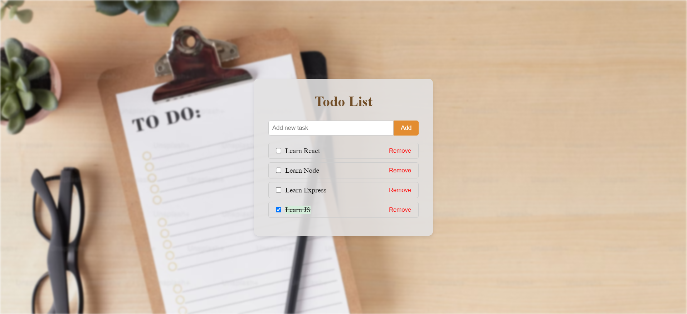

<div id="top"></div>

</br>
<div align="center">
      <a href="https://to-do-list-eosin-eta-82.vercel.app/">
       
      </a>
</div>

### Built With

- React
- Vite
- Module.css

### Features

- **Add Tasks**: Users can add new tasks to the list.
- **Remove Tasks**: Users can remove tasks from the list.
- **Mark as Completed**: Users can mark tasks as completed.
- **Persisted State**: Tasks are fetched from and updated to a mock API.
- **Optimized Performance**: Utilizes React's `useMemo` hook to optimize rendering.
- **Modern UI**: Clean and responsive user interface using CSS Modules.

<p align="right">(<a href="#top">back to top</a>)</p>

---

## Getting Started

This project require some perquisites and dependencies to be installed, you can find the instructions below:

### Installation

> To get a local copy, follow these simple steps :

1. Clone the repo

   ```sh
   git clone https://github.com/SayedShehata1/ToDo-list
   ```

2. go to client folder

   ```sh
   cd ToDo-list
   ```

3. install dependencies

   ```bash
   npm install
   ```

4. Run development server

   ```sh
   npm run dev
   ```

<p align="right">(<a href="#top">back to top</a>)</p>
